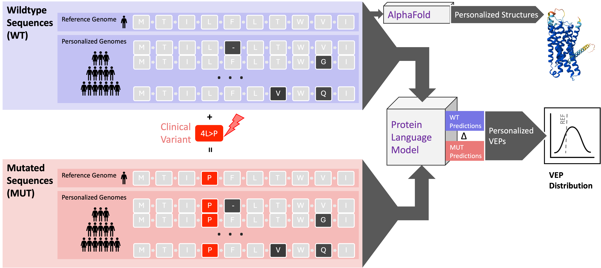

# VEP protein

Using protein sequence models to compute Variant Effect Predictions (VEP) across biobank-scale populations.



## Overview

This project aims to use **protein language models** (e.g. ESM2, ESM3) to score the effect of genetic variants on protein sequence, and to study how these **variant effect predictions (VEPs)** vary across **population-scale haplotypes** (e.g. 1000 Genomes, HGDP). The main goals are:

- **Population-aware VEP**: Compute VEPs not only for a single reference sequence, but for many haplotypes representing natural variation, so that predictions can be personalized to an individual’s genetic background.
- **Joint effects and interactions**: Quantify how **wild-type (WT) population variants** and **clinical or disease-associated variants** jointly influence VEP scores, and test for **non-additive interactions** between them. This helps interpret incomplete penetrance and context-dependent pathogenicity.
- **Benchmarking**: Compare protein-LM-based VEPs to clinical labels and to existing predictors using ProteinGym, ClinVar, and related resources.

The codebase provides pipelines to fetch haplotypes, run ESM-based scoring (e.g. masked-marginals, pseudo-ppl), merge and analyze VEP outputs, fit linear models for joint WT–clinical effects, and perform interaction testing. Results are intended to support both method development and applied analyses (e.g. penetrance, case studies).

---

## Table of contents

- [System requirements](#system-requirements)
- [Installation](#installation)
- [Demo](#demo)
- [Environment setup](#environment-setup)
- [Code organization](#code-organization)
- [Getting started](#getting-started)
- [Tutorials and notebooks](#tutorials-and-notebooks)
- [Documentation](#documentation)
- [Citation](#citation)
- [Manuscript](#manuscript)
- [License](#license)

---

## System requirements

- **Operating systems tested:** Linux (Ubuntu 20.04+ / RHEL 8+ on HPC), macOS 14+
- **Python:** 3.12.9 (3.10–3.12 also supported)
- **Key dependencies:** see `conda/*.yml` for per-model environments (`esm2.yml` is the main one; additional envs cover ESM3, ESMFold, evolocity, GenVarLoader, RAPIDS, Snakemake)
- **Non-standard hardware:** NVIDIA GPU required for ESM model inference (tested on A100 80 GB and H100 80 GB); CPU-only runs are possible for small examples but not recommended

## Installation

See the [Environment setup](#environment-setup) and [Getting started](#getting-started) sections below for step-by-step instructions. Typical install time on a workstation with conda already installed:

- **~15 min** to create the primary `esm2` conda environment
- Additional time on first run for one-time downloads of model weights from Hugging Face

> *Maintainer to confirm measured timings before final submission.*

## Demo

The fastest end-to-end demo is **`notebooks/VEP.ipynb`**, which loads protein haplotypes, injects a clinical variant, scores with ESM2-650M, and returns per-haplotype VEP scores.

- **Expected runtime:** ~5 min on 1× A100 GPU for the bundled example transcript
- **Expected output:** a Parquet file of per-haplotype VEP scores plus summary plots inline in the notebook

> *Maintainer to confirm measured timings before final submission.*

---

## Environment setup

Conda environment files live in **`conda/`**. Use the environment that matches what you want to run:

| Environment | File | Use case |
|-------------|------|----------|
| **esm2** | `conda/esm2.yml` | **Main VEP workflow**: ESM2 models, VEP pipeline, haplosaurus, ProteinGym, most analysis notebooks. **Start here for the VEP tutorial.** |
| **esm3** | `conda/esm3.yml` | ESM3 models and related notebooks. |
| **esmfold** | `conda/esmfold.yml` | ESMFold structure prediction (separate Python/toolchain). |

**Quick start:**

```bash
git clone https://github.com/bschilder/VEP_protein.git && cd VEP_protein
conda env create -f conda/esm2.yml
conda activate esm2
```

Then set **`DATA_DIR`** in [`src/config.py`](src/config.py) to the path where you want to store data (default: `~/projects/data/`). Use the **esm2** kernel when opening the [VEP tutorial notebook](notebooks/VEP.ipynb).

**Hardware:** A GPU is recommended for running ESM model inference; larger models and batch jobs will be slow on CPU only.

**Data:** External data (ProteinGym clinical sets, haplotype sequences from Haplosaurus/1000 Genomes, etc.) is downloaded on first use or by pipeline scripts into `DATA_DIR`. Ensure sufficient disk space for model weights and VEP outputs.

---

## Code organization

| Directory | Description |
|-----------|-------------|
| **`src/`** | Python package used by notebooks and scripts. Key modules: |
| → `vep_pipeline.py` | Runs the VEP pipeline (ESM models, scoring strategies, ProteinGym/clinical variants). |
| → `vep_analysis.py` | Analysis, plotting, and aggregation of VEP results (distributions, interactions, figures). |
| → `vep_metrics.py` | VEP-related metrics and evaluation. |
| → `haplosaurus.py` | Haplotype and population sequence handling (e.g. 1000 Genomes, HGDP). |
| → `proteingym.py` | ProteinGym clinical mutation and benchmark data. |
| → `config.py` | Global config: `DATA_DIR`, `PARAMS_VEP`, `PARAMS_HAPLOTYPES`, palettes. |
| → `analysis/` | Analysis helpers: attributions, distributions, matrices, VEP GMM. |
| → `Align/` | Alignment utilities (ClustalOmega, Clustalw). |
| → `benchmark/` | ClinVar and related benchmarking. |
| → `colabfold/` | ColabFold and categorical Jacobians. |
| → `ESM.py`, `ESM_predict.py`, `ESM3.py`, `ESMfold.py` | ESM model loading and inference. |
| **`notebooks/`** | Step-by-step tutorials and analyses; entry point for reproducing results. |
| **`config/`** | ProHap and other pipeline configs (YAML). |
| **`docs/`** | Method and metric write-ups (e.g. interactions). |
| **`scripts/`** | Shell scripts for batch runs (e.g. `vep_pipeline.sh`, haplosaurus/HGDP). |
| **`tests/`** | Pytest tests for haplotype ref, preprocessed index, ID mapping, mutation index, MSA query. |
| **`results/`** | Outputs (e.g. plots, parquet). |

Data (VEP outputs, caches, etc.) is written under **`DATA_DIR`** as set in `src/config.py`; the repo itself stays code-only.

---

## Getting started

1. **Clone and enter the repo**
   ```bash
   git clone https://github.com/bschilder/VEP_protein.git && cd VEP_protein
   ```

2. **Create and activate the main environment**
   ```bash
   conda env create -f conda/esm2.yml
   conda activate esm2
   ```

3. **Set the data directory**  
   Edit `DATA_DIR` in [`src/config.py`](src/config.py) to the on-disk location where you want to store data.

4. **Run the VEP tutorial**  
   Open [`notebooks/VEP.ipynb`](notebooks/VEP.ipynb), select the **esm2** kernel, and run the cells. The notebook imports `src` (e.g. `vep_pipeline`, `vep_analysis`, `haplosaurus`, `proteingym`) and walks through loading proteins, clinical variants, and computing VEPs.

---

## Tutorials and notebooks

Notebooks are the main way to reproduce and explore the analyses.

| Notebook | Description |
|----------|-------------|
| **[VEP.ipynb](notebooks/VEP.ipynb)** | **Main tutorial**: VEP with protein LMs — candidate proteins, ProteinGym clinical mutations, pipeline usage. |
| [VEP_case_studies.ipynb](notebooks/VEP_case_studies.ipynb) | Case studies using the VEP pipeline. |
| [VEP_embeddings.ipynb](notebooks/VEP_embeddings.ipynb) | Embeddings and VEP. |
| [VEP_penetrance.ipynb](notebooks/VEP_penetrance.ipynb) | Penetrance-related VEP analysis. |
| [variant_annotation.ipynb](notebooks/variant_annotation.ipynb) | Variant annotation workflow. |
| [variant_attribution.ipynb](notebooks/variant_attribution.ipynb) | Attribution for variants. |
| [ProHap.ipynb](notebooks/ProHap.ipynb) | ProHap haplotype workflow. |
| [haplosaurus.ipynb](notebooks/haplosaurus.ipynb) | Haplosaurus and haplotype handling. |
| [1KG.ipynb](notebooks/1KG.ipynb), [1KG_wt.ipynb](notebooks/1KG_wt.ipynb) | 1000 Genomes–based analyses. |
| [HGDP.ipynb](notebooks/HGDP.ipynb) | HGDP population analyses. |
| [ProteinGym.ipynb](notebooks/ProteinGym.ipynb) | ProteinGym benchmarks. |
| [Zenodo.ipynb](notebooks/Zenodo.ipynb) | Upload/download manuscript data to Zenodo (personalizedVEP record). |
| [ESM3.ipynb](notebooks/ESM3.ipynb) | ESM3 model usage. |
| [evolocity.ipynb](notebooks/evolocity.ipynb) | Evolocity analysis (use `conda/evolocity.yml`). |
| [GVL.ipynb](notebooks/GVL.ipynb) | GVL workflow (use `conda/gvl.yml`). |
| [distributions.ipynb](notebooks/distributions.ipynb), [embeddings.ipynb](notebooks/embeddings.ipynb) | Distribution and embedding analyses. |
| [colabfold.ipynb](notebooks/colabfold.ipynb), [categorical_jacobians.ipynb](notebooks/categorical_jacobians.ipynb) | ColabFold and Jacobians. |

Other notebooks in `notebooks/` (e.g. ensemblVEP, OpenTargets, patient_embeddings) follow the same pattern: they rely on `src/` and optional conda envs as noted above.

---

## Documentation

- **[Interaction metrics](docs/epistasis_metrics_explanation.md)** — Definitions and usage of interaction metrics (e.g. `deviation_from_additive`, `delta_r2`, `epistasis_fstat`).  
- **[Methods (interactions)](docs/methods_epistasis.md)** — Methodological details for interaction analyses.

---

## Running tests

From the repo root with the appropriate environment activated (e.g. `esm2`):

```bash
pytest tests/ -v
```

This runs tests in `tests/` (haplotype ref, preprocessed index, ID mapping, mutation index, MSA query).

---

## Citation

If you use this code in your work, please cite the accompanying manuscript (see [Manuscript](#manuscript)). BibTeX and DOI can be added here once available.

---

## Manuscript

The **`manuscript/`** directory contains the accompanying manuscript sources, including **`manuscript/figures.ipynb`** (figure generation) and **`manuscript/fig/`**, **`manuscript/tbl/`** for figures and tables.

---

## License

This project is licensed under the **MIT License** (OSI-approved). See [LICENSE](LICENSE) for the full terms.
